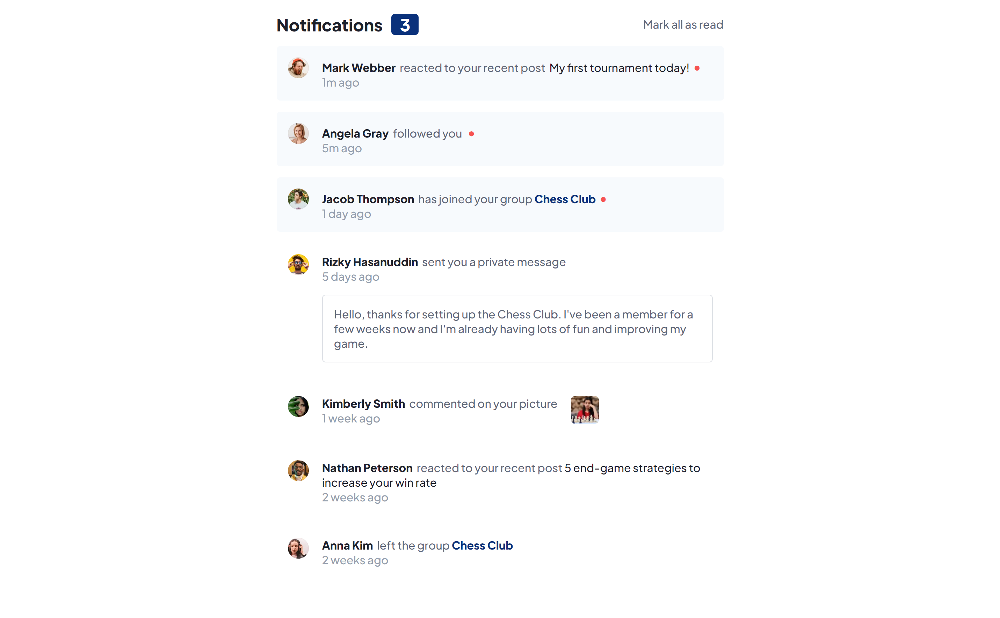
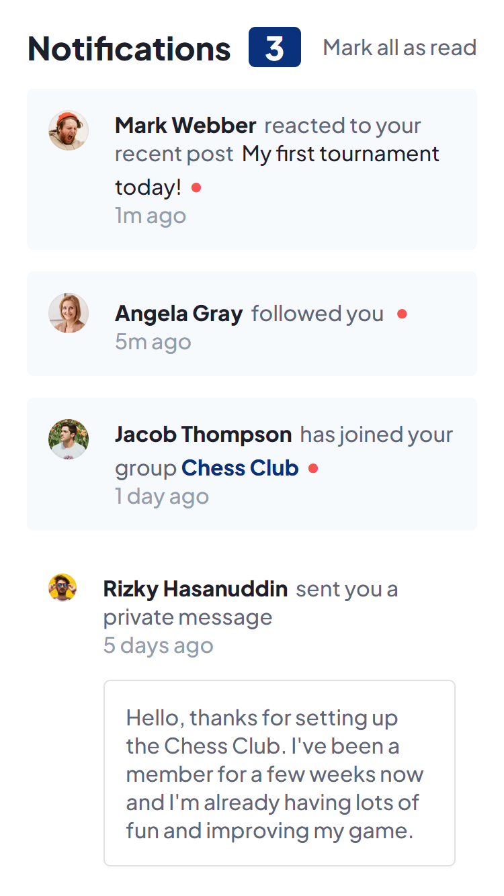

# Frontend Mentor - Loopstudios landing page solution

This is one of my old projects that I made and forgot to publish back then. 
It is a solution to the [Notifications page challenge on Frontend Mentor](https://www.frontendmentor.io/challenges/notifications-page-DqK5QAmKbC).

## Table of contents

- [Overview](#overview)
  - [Built with](#built-with)
  - [Links](#links)
  - [Screenshot](#screenshot)

## Overview

### Built with

- HTML
- CSS
- JavaScript

### Links

-  [Live Site URL](https://zsolt270.github.io/Notifications-page/) 

### Screenshot

 
 

